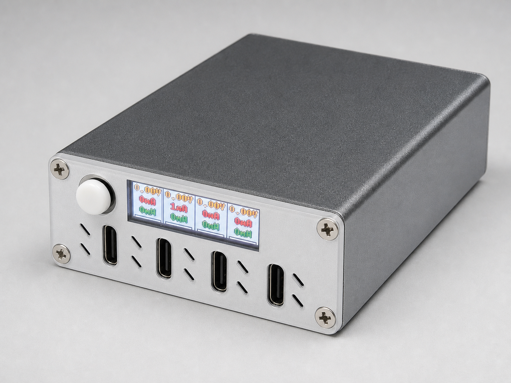

# isolarail

Four-port USB hub control plane for the current V3 hardware baseline:
`ESP32-S3 + CH335F + M24C64@0x50 + EN1..EN4 + PWREN#/OVCUR# + LCD/front panel`.

Owner-facing naming is fixed as:

- firmware identity: `isolarail`
- local CLI: `isolarail`
- local daemon: `isolarail-devd`

## Product image



## Brand assets

Project brand assets live in [docs/assets/brand](docs/assets/brand/README.md):

- Primary logo: [isolarail-logo-lockup.png](docs/assets/brand/isolarail-logo-lockup.png)
- App icon: [isolarail-app-icon.png](docs/assets/brand/isolarail-app-icon.png)
- Poster: [isolarail-poster.png](docs/assets/brand/isolarail-poster.png)
- GitHub social preview: [isolarail-github-social-preview.png](docs/assets/brand/isolarail-github-social-preview.png)

## Developer entrypoints

Use `just` as the only normal developer entrypoint.

### Firmware

```bash
just firmware-check
just firmware-build
just ports
PORT=/dev/cu.usbmodem1101 just identify
just firmware-bin
just flash-monitor
```

Notes:

- `just flash-monitor` builds the app image, validates the selected device identity, flashes at `0x10000`, resets, and opens the monitor path.
- `cargo run --release` uses `tools/isolarail-runner` and follows the same Local USB safety boundary.
- `just flash-first-time` is the explicit download-mode/non-project firmware path and requires typed confirmation from `isolarail`.
- The previous Makefile, direct `espflash flash --monitor`, and `mcu-agentd` flashing entrypoints are retired.
- No hardware command should be run against an unrelated board.

### Local companion tools

`isolarail` is the normal local USB entrypoint. It discovers or auto-starts the native-IPC `isolarail-devd serve` singleton when needed.

Important:

- Use the `just` entrypoints for companion development from the repo root.
- If you run companion Cargo commands manually, run them from `tools/isolarail-companion/`.
- Do not rely on `cargo --manifest-path tools/isolarail-companion/Cargo.toml ...` from the repo root; the root Xtensa default target can leak into that invocation.

```bash
just tools-build
just tools-test
just isolarail --help
just devd-help
```

### Hardware diagnostic snapshot

Firmware exposes a read-only hardware snapshot through the Local USB JSONL method
`hardware.snapshot`. Use the project CLI/devd path:

```bash
SELECTOR='--device <device-id>' just diag-snapshot
SELECTOR='--device <device-id>' just isolarail --json diag-snapshot
```

The snapshot covers input power, I²C topology, CH335F sideband, front panel, MCU internal temperature, fan control/telemetry, buzzer runtime state, boot self-check state, per-port hardware control gates, and four output modules. Output-module INA226/TMP112 nodes include read-only readings and register values when online, not just probe booleans. Optional front-panel and output-module devices report `online` / `offline` / `skipped` / `error` locally; absence of one node must not fail the whole snapshot.

The Web app exposes the advanced hardware debug route under each device:

```text
/devices/:deviceId/debug/hardware
```

This debug surface is read-only. It does not write registers, reset devices, flash firmware, or control port power.

Common device commands:

```bash
just discover
just devices
just hardware-available

SELECTOR='--device <device-id>' just status
SELECTOR='--device <device-id>' just device-ports
SELECTOR='--device <device-id>' just wifi-show

SELECTOR='--device <device-id>' PORT=port1 ENABLED=true just port-power
SELECTOR='--device <device-id>' PORT=port1 just port-replug
SELECTOR='--device <device-id>' just device-reset

SELECTOR='--device <device-id>' SSID='Lab WiFi' PSK='secret' just wifi-set
SELECTOR='--device <device-id>' just wifi-clear

SELECTOR='--device <device-id>' TAIL=200 just device-monitor
SELECTOR='--device <device-id>' just diag-snapshot
SELECTOR='--device <device-id>' just diagnostics-export
```

Notes:

- `just device-monitor` reads the recent Local USB serial activity timeline from `isolarail-devd`.
- `just diag-snapshot` returns the firmware `isolarail.hardware.snapshot.v1` object.
- `just diagnostics-export` exports a companion-aggregated diagnostics snapshot built from the current `status`, `ports`, `wifi`, `hardware_snapshot`, and recent serial session traces for the selected device.

To restrict companion discovery and Local USB operations to one specific serial device during development, pass `USB_PORT`:

```bash
USB_PORT=/dev/cu.usbmodem2123101 just discover
USB_PORT=/dev/cu.usbmodem2123101 just devd-serve
USB_PORT=/dev/cu.usbmodem2123101 just isolarail --help
```

`USB_PORT` is forwarded to `ISOLARAIL_USB_PORT`, so scan, JSONL, flash, reset, and monitor paths reject other serial ports.

Recommended HIL sequence for one board:

```bash
USB_PORT=/dev/cu.usbmodem21234101 just discover
USB_PORT=/dev/cu.usbmodem21234101 SELECTOR='--device usb--dev-cu-usbmodem21234101' just status
USB_PORT=/dev/cu.usbmodem21234101 SELECTOR='--device usb--dev-cu-usbmodem21234101' just device-ports
USB_PORT=/dev/cu.usbmodem21234101 SELECTOR='--device usb--dev-cu-usbmodem21234101' just wifi-show
USB_PORT=/dev/cu.usbmodem21234101 SELECTOR='--device usb--dev-cu-usbmodem21234101' TAIL=12 just device-monitor
```

Notes:

- Run Local USB commands sequentially against one board. The companion enforces per-port mutual exclusion, so overlapping `status` / `ports` / `wifi-show` / `port-power` runs can legitimately return `device busy`.
- Mutating commands such as `port-power` and `port-replug` may need a short settle window before a follow-up `just device-ports` reflects the new state.
- `just device-reset` reboots the board and temporarily drops the USB session. Treat it as a standalone command, then wait for re-enumeration before the next `discover` / `status`.

Selector rules:

- Use `SELECTOR='--device <device-id>'` for a currently connected temporary USB target.
- Use `SELECTOR='--hardware <saved-id>'` for a saved hardware profile.
- `just wifi-set` and `just wifi-clear` require `--device` or a USB-backed `--hardware` selector. `--url` and Wi-Fi/LAN saved hardware stay read-only for Wi-Fi writes.

### devd modes

`isolarail-devd` has two distinct modes:

- `serve`: native IPC only, default daemon mode
- `web`: explicit localhost Web companion for browser development and same-origin Web hosting

Manual daemon startup is a development and diagnostics path, not the normal user workflow.

```bash
just devd-serve
just devd-web
```

Important:

- `just devd-serve` starts the native IPC daemon path only.
- `just devd-web` is the opt-in browser Web companion. It is not the default daemon mode.
- Both repo-root `just` commands invoke the Rust `isolarail-devd` binary directly from `tools/isolarail-companion/`.
- On Unix, IPC uses the runtime socket returned by `default_ipc_endpoint()`.
- On Windows, IPC uses `\\.\pipe\isolarail-devd`.

### Web

```bash
just web-install
just web-check
just web-lint
just web-build
just web-test-unit
just web-storybook
```

For browser development that needs Local USB or companion-backed storage:

```bash
BIND=127.0.0.1:51200 ALLOW_DEV_CORS=1 just devd-web
DEVD_ORIGINS=http://isolarail-devd.local:51200,http://127.0.0.1:51200 just web-dev
```

The Web app never scans localhost ports. `DEVD_ORIGINS` is an explicit ordered list: put the mDNS URL first, then an IP or localhost fallback. `ALLOW_DEV_CORS=1` is only needed when the Vite page directly tries multiple configured origins; same-origin `--web-root` hosting does not need it.

### Documentation site

The publishable documentation site lives in `docs-site/`. It is a bilingual product and engineering documentation entrypoint built with Rspress.

```bash
bun install --frozen-lockfile
bun run docs:build
DOCS_PORT=50885 bun run docs:preview
```

Local builds default to a root path. The GitHub Pages workflow defaults to the repository project path
and can be overridden with `DOCS_BASE`, including `/` for a configured custom domain:

```bash
DOCS_BASE=/preview/ bun run docs:build
```

## Toolchain

The firmware build expects the `esp` Rust toolchain:

```bash
cargo install espup
espup install
source ~/export-esp.sh
cargo install espflash
```

`espflash` is an internal backend used by `isolarail-devd`; do not use it as the firmware flashing entrypoint.

## Validation status

Re-verified on the current `HEAD` in this dev environment:

- `just --summary`
- `just tools-build`
- `just tools-test`
- `just web-check`
- `just web-build`
- `just web-test-unit`
- `just isolarail --help`
- `just devd-help`
- `just firmware-check`
- `just firmware-contract-test`
- `cargo +esp check`
- `cargo +esp build --release`
- `just firmware-build`
- `just firmware-bin`

Additional quality gates that remain part of the expected developer workflow, but were not re-run in this pass:

- `just web-test-companion-bridge`
- `just web-test-e2e`
- `just web-test-storybook`

## Reference docs

- [docs-site](docs-site/docs/zh/index.mdx)
- [docs/hardware_connection_overview.md](docs/hardware_connection_overview.md)
- [docs/specs/j6nvw-hardware-v3-pin-assignment/SPEC.md](docs/specs/j6nvw-hardware-v3-pin-assignment/SPEC.md)
- [docs/software_design.md](docs/software_design.md)
- [tools/buzzer_audio_preview/README.md](tools/buzzer_audio_preview/README.md)
- [web/README.md](web/README.md)
- [docs/specs/README.md](docs/specs/README.md)
