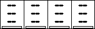

# Dashboard (160×50) — Four-Column Layout

This document specifies a four-column dashboard for a 160×50 px panel
aligned with the four horizontally placed USB‑C ports. The target panel
is RGB565; color is used for clarity. The spec covers pixel grid, fonts,
string budgets, formatting, and a minimal power bar per column.

Preview (per‑pixel SVG): 
Note: the SVG is composed of exactly 160×50 1×1 rectangles, one for each pixel.

---

## 1. Screen & Fonts

- Logical resolution: 160×50 px.
- Panel format: RGB565 (color).
- Fonts (monospace):
  - Values (V/I/W): 7×13 bold glyphs (advance 7 px), baseline Top.
  - No header labels in production layout.

## 2. Column Grid (x‑axis)

- Four equal columns: 40 px each.
- Optional separators at x = 40, 80, 120 px (1 px stroke).
- Text area per column: ~36 px (leave ~2 px inner padding per side).

```text
|<--40-->||<--40-->||<--40-->||<--40-->|
0        40        80        120       160  (px)
```

## 3. Row Grid (y‑axis)

- Voltage row: top y = 2 (covers ~2–14).
- Current row: top y = 17 (covers ~17–29).
- Power row: top y = 32 (covers ~32–44).
- Power bar area: 48–49 px (2 px tall) in preview assets; firmware uses 47–49 (3 px) if needed.
- Bottom border at 49 px.

```text
0  ─ header (labels)
8  - - - guide
15 ─ V row baseline (6×8)
23 ─ I row baseline (6×8)
31 ─ W row baseline (6×8)
42 ─ top of bar area
44 ┌ power bar (4 px tall)
48 └ end of bar
49 ─ bottom border
```

The colored previews use 7×13 bold for improved readability while fitting into each 40 px column.

## 4. String Budgets (per cell)

- Available width ≈ 36 px → up to 5 glyphs with 7 px advance (value rows).
- Examples that fit (≤ 5 chars):
  - Voltage: `5.12V`, `20.0V`, `9.00V`.
  - Current: `0.98A`, `2.50A`, `650mA`.
  - Power: `4.9W`, `22.5W`, `30.0W`.
- Disconnected/unknown: `--` (2) or `0mA`/`0W`.

## 5. Number Formatting

- Voltage (V):
  - < 10 V → 2 decimals (e.g., `5.12V`).
  - ≥ 10 V → 1 decimal (e.g., `20.0V`).
- Current (A/mA):
  - ≥ 1 A → show in A with 2 decimals (e.g., `2.50A`).
  - < 1 A → show in mA, no decimals (e.g., `650mA`).
- Power (W/mW):
  - ≥ 1 W → 1 decimal (e.g., `13.0W`).
  - < 1 W → show in mW (e.g., `750mW`).
- Rounding: round half up; clamp to column width if needed.

## 6. Power Bar (per column)

- Position: x inset = 3 px; y = 48–49 px; width = 34 px; height = 2 px (SVG preview). Firmware may use 3 px (47–49).
- Outline: 1 px black rectangle.
- Fill: black from left to right proportional to load.
- Normalization:
  - Preferred: `current_port_power / negotiated_max_power`.
  - Negotiated max comes from policy (PDO/QC etc.). If unavailable,
    fall back to configured per-port ceiling.

## 7. States & Indicators (compact)

- Column label: `C1`..`C4`.
- Optional 2–3 letter flags near the label when space permits:
  - `PD`, `QC` (protocol), `OC` (overcurrent), `OT` (overtemp),
    `UV/OV` (under/overvoltage), `DIS` (disconnected).
- Error style: avoid blinking except for critical faults; prefer
  inverse (white text on black background) for the selected column.

## 8. Refresh & Smoothing

- Refresh cadence: 2 Hz (every 500 ms).
- Smoothing: 1–2 s sliding average on current and power to reduce
  flicker; immediate refresh on state transitions or ≥ 10% delta.

## 9. Input Mapping (five‑way)

- Left/Right: move selection across the 4 columns.
- Up/Down: cycle display modes (standard / bold power / hide units) or
  enter/exit per‑column detail view.
- Center (short): toggle detail view for the selected column.
- Center (long): quick menu (clear peak, reset, etc.).

## 10. Data Source Notes

- Dashboard consumes `V/I/W` from a data service. The hardware backend
  may aggregate measurements from INA226/TPS devices or estimates tied
  to port controllers (e.g., SW2303 negotiation info). For accuracy,
  prefer measured values for `I` and `V`; compute `W = V × I`.

## 11. Assets

- Color SVG (per‑pixel, 1×1 rects; normal): `docs/assets/dashboard_wireframe_160x50_color_bold.svg`
- Color SVG (per‑pixel, 1×1 rects; disconnected): `docs/assets/dashboard_wireframe_160x50_disconnected_color_bold.svg`

## 12. Color Scheme (RGB565)

- Background: `#FFFFFF` (pure white; RGB565 ≈ `0xFFFF`).
- Text/separators/border (default): `#000000` (RGB565 = `0x0000`).
- Voltage (V) text: `#FFCC00` (deep yellow; RGB565 ≈ `0xFF20`).
- Current (A) text: `#D32F2F` (red; RGB565 ≈ `0xB0E9`).
- Power (W) text & bars: `#2E7D32` (green; RGB565 ≈ `0x23E6`).
- Contrast: on a light background, use a deeper yellow to keep thin strokes readable (aim to approximate a 4.5:1 text contrast).

Note: the SVGs are per‑pixel and intended as canonical dashboard previews.

## 13. Disconnected Example

When a USB port module is not present or not connected:

- Show a `DIS` tag near the column label.
- Show `--` for V/I/W rows.
- Leave the power bar empty (outline only).

SVG preview (per‑pixel): 

<!-- End of finalized spec -->
