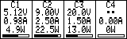
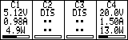

# Dashboard (160×50) — Four-Column Layout

This document specifies a four-column dashboard for a 160×50 px
monochrome (1‑bit) display, aligned with the four horizontally placed
USB‑C ports. It defines pixel grid, fonts, string budgets, formatting,
and a minimalist power bar per column.

Preview (pixel-accurate): 
Related PBM: `docs/assets/dashboard_wireframe_160x50.pbm`（1‑bit；与硬件 1:1 像素映射）。

---

## 1. Screen & Fonts

- Resolution: 160×50 px, 1‑bit (black/white).
- Font: monospace bitmap.
  - Recommended: 5×9 glyphs in 6×10 cells（宽度不变，高度提升）。
  - Fallback: 5×7.
- Line height: 10 px per文本行（使用 5×9 字形，单元格 6×10）。

## 2. Column Grid (x‑axis)

- Four equal columns: 40 px each.
- Optional separators at x = 40, 80, 120 px (1 px stroke).
- Text area per column: ~36 px (leave ~2 px inner padding per side).

```text
|<--40-->||<--40-->||<--40-->||<--40-->|
0        40        80        120       160  (px)
```

## 3. Row Grid (y‑axis)

- Header: 0–9 px（标签 C1–C4，5×9 字形）。
- Voltage row: 顶部 y ≈ 11（占用 11–19）。
- Current row: 顶部 y ≈ 22（占用 22–30）。
- Power row: 顶部 y ≈ 33（占用 33–41）。
- 过渡留白：y=42–43。
- Power bar area: 44–48 px（4 px 高）。
- Bottom border at 49 px。

```text
0  ─ header (labels)
8  - - - guide
15 ─ V row baseline (6×8)
23 ─ I row baseline (6×8)
31 ─ W row baseline (6×8)
42 ─ top of bar area
44 ┌ power bar (4 px tall)
48 └ end of bar
49 ─ bottom border
```

参见 `docs/assets/dashboard_wireframe_160x50.pbm` 获取按像素刻画的线框图（5×9 字形）。

## 4. String Budgets (per cell)

- Available width ≈ 36 px → up to 6 glyphs with 6 px advance.
- Examples that fit (≤ 6 chars):
  - Voltage: `5.12V` (5), `20.0V` (5), `9.00V` (5)
  - Current: `0.98A` (5), `2.50A` (5), `650mA` (5)
  - Power: `4.9W` (4), `13.0W` (5), `100.0W` (6)
- Disconnected/unknown: `--` (2) or `0mA`/`0W`.

## 5. Number Formatting

- Voltage (V):
  - < 10 V → 2 decimals (e.g., `5.12V`).
  - ≥ 10 V → 1 decimal (e.g., `20.0V`).
- Current (A/mA):
  - ≥ 1 A → show in A with 2 decimals (e.g., `2.50A`).
  - < 1 A → show in mA, no decimals (e.g., `650mA`).
- Power (W/mW):
  - ≥ 1 W → 1 decimal (e.g., `13.0W`).
  - < 1 W → show in mW (e.g., `750mW`).
- Rounding: round half up; clamp to column width if needed.

## 6. Power Bar (per column)

- Position: x inset = 3 px; y = 44–48 px; width = 34 px; height = 4 px.
- Outline: 1 px black rectangle.
- Fill: black from left to right proportional to load.
- Normalization:
  - Preferred: `current_port_power / negotiated_max_power`.
  - Negotiated max comes from policy (PDO/QC etc.). If unavailable,
    fall back to configured per-port ceiling.

## 7. States & Indicators (compact)

- Column label: `C1`..`C4`.
- Optional 2–3 letter flags near the label when space permits:
  - `PD`, `QC` (protocol), `OC` (overcurrent), `OT` (overtemp),
    `UV/OV` (under/overvoltage), `DIS` (disconnected).
- Error style: avoid blinking except for critical faults; prefer
  inverse (white text on black background) for the selected column.

## 8. Refresh & Smoothing

- Refresh cadence: 2 Hz (every 500 ms).
- Smoothing: 1–2 s sliding average on current and power to reduce
  flicker; immediate refresh on state transitions or ≥ 10% delta.

## 9. Input Mapping (five‑way)

- Left/Right: move selection across the 4 columns.
- Up/Down: cycle display modes (standard / bold power / hide units) or
  enter/exit per‑column detail view.
- Center (short): toggle detail view for the selected column.
- Center (long): quick menu (clear peak, reset, etc.).

## 10. Data Source Notes

- Dashboard consumes `V/I/W` from a data service. The hardware backend
  may aggregate measurements from INA226/TPS devices or estimates tied
  to port controllers (e.g., SW2303 negotiation info). For accuracy,
  prefer measured values for `I` and `V`; compute `W = V × I`.

## 11. Asset

- Wireframe（per‑pixel, 1‑bit）
  - SVG 预览：`docs/assets/dashboard_wireframe_160x50.svg`
  - PBM 源：`docs/assets/dashboard_wireframe_160x50.pbm`
  - 格式：PBM P1（1=黑，0=白），尺寸 160×50，像素 1:1 对映。
  - 内容：四列、x=40/80/120 分隔线、3 行读数（5×9 字形，6×10 单元）、4 px 高功率条。

## 12. Disconnected Example

当 USB 模块未插装/未连接时：

- 列表头右侧显示 `DIS` 标记；
- V/I/W 行显示 `--`；
- 功率条为空（仅显示轮廓）。

像素示意：

## 12. Next Steps

- Confirm font (6×8 vs 5×7) and renderer.
- Prototype renderer with the above grid and formatting rules.
- Bind five‑way input and selection highlight.
- Map data service to measurement backend.
