# 品牌视觉资产（#b8r3n）

## 状态

- Lifecycle: active
- Implementation: 已完成，随 PR #32 落地

## 背景 / 问题陈述

IsolaRail 需要一组可直接用于 README、GitHub repository social card、后续 HTML 海报和项目宣传材料的品牌资产。资产必须让主人能快速判断“哪个是最终成品、哪个是变体、哪个只是后续布局素材”，并且在 spec 内可直接预览。

## 目标 / 非目标

### Goals

- 固定 IsolaRail 当前选定的 Logo、App Icon、海报和 GitHub Social preview。
- GitHub Social preview 必须有一个主图和一个变体，并都保存在项目内。
- 保留后续 HTML 海报可复用的产品场景素材。
- 在本 spec 内完整列出所有品牌资产、用途、尺寸、文件大小和预览图。

### Non-goals

- 不重新打开 Logo 方向选择。
- 不在本次实现 HTML 海报页面或模板。
- 不把产品场景素材误标为最终海报。
- 不用当前生成图替代硬件事实或硬件规格文档。

## 范围

### In scope

- `docs/assets/brand/**` 品牌图片资产。
- `docs-site/docs/public/**` 文档站运行时品牌静态资产。
- `web/public/**` Web 控制台运行时品牌静态资产。
- README 中品牌资产入口。
- 本 spec 的资产清单和视觉预览。

### Out of scope

- Firmware source behavior changes.
- Hardware wiring / BOM / netlist changes.
- GitHub repository settings 中实际上传 social preview 的 owner 侧操作。

## 需求

### MUST

- `isolarail-logo-lockup.png` 是当前主 Logo。
- `isolarail-logo-lockup.svg`、`isolarail-logo-lockup-light.svg` 和 `isolarail-logo-lockup-dark.svg` 是 Logo 的 410 x 226 true SVG 几何版本，不得使用 `<image>`、`base64` 或 `data:image` 嵌入 raster。
- `isolarail-app-icon.png` 是当前已批准的 App Icon 设计源图。
- `isolarail-logo-lockup-light.png` 和 `isolarail-logo-lockup-dark.png` 是 Logo 的亮色/暗色主题运行时版本。
- `isolarail-app-icon-light.svg` 和 `isolarail-app-icon-dark.svg` 是从已批准 App Icon 像素坐标还原的 1024 x 1024 SVG 主题源文件。
- `isolarail-app-icon-light.png` 和 `isolarail-app-icon-dark.png` 是 App Icon 的亮色/暗色主题运行时版本。
- `isolarail-poster.png` 是当前单张最终海报。
- `isolarail-github-social-preview.png` 是 GitHub Social preview 主图。
- `isolarail-github-social-preview-variant.png` 是 GitHub Social preview 变体。
- 两张 GitHub Social preview 必须保持 2:1 附近画幅，并控制在 GitHub 上传限制内。
- 产品图形不得出现明显违背常识的形体错误，例如楔形尾部、三角侧板、端口数量异常或不可能透视。
- 产品场景素材必须保留为后续 HTML 海报布局输入，但不得冒充最终海报。

### SHOULD

- 资产文件名应体现用途，避免 `source` / `layout` 等含糊名称进入最终成品清单。
- SPEC 和 `docs/assets/brand/README.md` 应保持用途说明一致。
- README 只暴露最常用的成品入口，详细预览以本 spec 为准。
- `docs-site` 和 `web` 不应继续使用 Vite/Rspress 默认占位图标。

## 资产清单

| Asset | Role | Dimensions | Size | Usage |
| --- | --- | --- | --- | --- |
| `docs/assets/brand/isolarail-logo-lockup.png` | Logo 主锁定图 | 410 x 226 | 49,084 bytes | README、文档站、品牌露出 |
| `docs/assets/brand/isolarail-logo-lockup.svg` | Logo 主锁定图 SVG | 410 x 226 SVG | 2,498 bytes | true SVG 路径和矩形几何源 |
| `docs/assets/brand/isolarail-logo-lockup-light.svg` | Logo 亮色 SVG | 410 x 226 SVG | 2,510 bytes | light theme true SVG 源 |
| `docs/assets/brand/isolarail-logo-lockup-dark.svg` | Logo 暗色 SVG | 410 x 226 SVG | 2,509 bytes | dark theme true SVG 源 |
| `docs/assets/brand/isolarail-logo-lockup-light.png` | Logo 亮色主题版 | 410 x 226 | 5,652 bytes | 浅色背景 UI / docs-site logo |
| `docs/assets/brand/isolarail-logo-lockup-dark.png` | Logo 暗色主题版 | 410 x 226 | 4,658 bytes | 深色背景 UI / docs-site logo |
| `docs/assets/brand/isolarail-app-icon.png` | App Icon 设计源图 | 1024 x 1024 | 45,171 bytes | App 图标、头像、方形入口 |
| `docs/assets/brand/isolarail-app-icon-light.svg` | App Icon 亮色 SVG 源 | 1024 x 1024 SVG | 1,328 bytes | light App Icon 运行时导出源 |
| `docs/assets/brand/isolarail-app-icon-dark.svg` | App Icon 暗色 SVG 源 | 1024 x 1024 SVG | 1,018 bytes | dark App Icon 运行时导出源 |
| `docs/assets/brand/isolarail-app-icon-light.png` | App Icon 亮色主题版 | 1024 x 1024 | 19,552 bytes | favicon、touch icon、manifest icon 源 |
| `docs/assets/brand/isolarail-app-icon-dark.png` | App Icon 暗色主题版 | 1024 x 1024 | 19,327 bytes | dark favicon、dark manifest icon 源 |
| `docs/assets/brand/isolarail-poster.png` | 最终海报 | 1024 x 1536 | 2,143,451 bytes | 单张品牌海报 |
| `docs/assets/brand/isolarail-github-social-preview.png` | GitHub Social preview 主图 | 1774 x 887 | 147,506 bytes | Repository social card 主图 |
| `docs/assets/brand/isolarail-github-social-preview-variant.png` | GitHub Social preview 变体 | 1774 x 887 | 379,129 bytes | 备用 social card / campaign variant |
| `docs/assets/brand/isolarail-product-scene-portrait.png` | HTML 海报产品场景素材 | 1024 x 1536 | 2,118,932 bytes | 后续可复制 HTML 海报布局输入 |
| `docs/assets/brand/isolarail-product-scene-wide.png` | HTML 海报宽幅产品场景素材 | 1774 x 887 | 1,847,567 bytes | 后续可复制 HTML social/hero 布局输入 |

## 项目消费资产导出

`docs-site/docs/public/` 和 `web/public/` 各自包含同名运行时资产，方便两个前端入口独立构建和部署。

| Asset | Dimensions / Type | Size | Used by |
| --- | --- | --- | --- |
| `favicon.ico` | ICO, 64/48/32/16 | 32,038 bytes | Browser tab favicon |
| `favicon-16x16.png` / `favicon-light-16x16.png` | 16 x 16 transparent PNG | 1,028 bytes | Browser favicon fallback / light theme |
| `favicon-32x32.png` / `favicon-light-32x32.png` | 32 x 32 transparent PNG | 1,741 bytes | Browser favicon fallback / light theme |
| `favicon-dark-16x16.png` | 16 x 16 transparent PNG | 1,027 bytes | Browser favicon dark theme |
| `favicon-dark-32x32.png` | 32 x 32 transparent PNG | 1,668 bytes | Browser favicon dark theme |
| `apple-touch-icon.png` / `apple-touch-icon-light.png` | 180 x 180 transparent PNG | 5,837 bytes | iOS home-screen icon / light theme |
| `apple-touch-icon-dark.png` | 180 x 180 transparent PNG | 6,475 bytes | iOS home-screen icon dark theme export |
| `isolarail-icon-192.png` / `isolarail-icon-light-192.png` | 192 x 192 transparent PNG | 6,245 bytes | Web manifest icon / light theme |
| `isolarail-icon-512.png` / `isolarail-icon-light-512.png` | 512 x 512 transparent PNG | 13,237 bytes | Web manifest icon / light theme |
| `isolarail-icon-dark-192.png` | 192 x 192 transparent PNG | 6,910 bytes | Web manifest icon dark theme |
| `isolarail-icon-dark-512.png` | 512 x 512 transparent PNG | 13,793 bytes | Web manifest icon dark theme |
| `isolarail-logo-lockup.png` | 410 x 226 transparent PNG | 5,652 bytes | Runtime logo default export, aliases light theme |
| `isolarail-logo-lockup.svg` | 410 x 226 SVG | 2,498 bytes | Runtime logo default true SVG export |
| `isolarail-logo-lockup-light.svg` | 410 x 226 SVG | 2,510 bytes | Runtime logo light theme true SVG |
| `isolarail-logo-lockup-dark.svg` | 410 x 226 SVG | 2,509 bytes | Runtime logo dark theme true SVG |
| `isolarail-logo-lockup-light.png` | 410 x 226 transparent PNG | 5,652 bytes | Runtime logo light theme |
| `isolarail-logo-lockup-dark.png` | 410 x 226 transparent PNG | 4,658 bytes | Runtime logo dark theme |
| `isolarail-social-preview.png` | 1774 x 887 PNG | 147,506 bytes | Open Graph / Twitter image |
| `site.webmanifest` | Web app manifest | docs-site 695 bytes; web 675 bytes | PWA metadata |

## 功能与行为规格

- GitHub Social preview 主图采用更扁平、正面/轻微俯视的产品表达，优先满足 GitHub 上传体积和远距离可读性。
- GitHub Social preview 变体采用更写实、斜向产品表达，优先满足 campaign preview 的质感和空间感。
- 海报是带 Logo、标题层级、产品主视觉和底部信息的最终海报，不是单纯产品场景图。
- 产品场景素材只作为后续 HTML 海报或 social layout 的输入图，不作为最终成品露出。
- Runtime icon exports must use transparent canvases. The icon body may be a white or dark rounded tile, but the area outside the tile must remain transparent.
- Runtime App Icon theme exports must be generated from the 1024 x 1024 SVG sources restored from the approved App Icon geometry.
- Runtime Logo theme exports must include 410 x 226 true SVG geometry files built from clean paths and rectangles, with light and dark variants sharing the same geometry.
- Runtime favicon exports must provide both light and dark variants using `prefers-color-scheme`.
- `docs-site/rspress.config.ts` must wire favicon, logo, manifest, Open Graph and Twitter image metadata to the exported runtime assets.
- `web/index.html` must wire favicon, Apple touch icon, manifest, Open Graph and Twitter image metadata to the exported runtime assets.
- Open Graph and Twitter image metadata must use an absolute production URL for social crawler compatibility.

## 验收标准

- Given 品牌资产被合入仓库，When 阅读 `docs/assets/brand/README.md`，Then 每个文件用途清晰且没有含糊的 social layout source 命名。
- Given 阅读本 spec，When 查看 `## Visual Evidence`，Then 能直接预览 Logo、已批准的 App Icon 设计源图、海报、GitHub Social preview 主图、变体和产品场景素材。
- Given 上传 GitHub Social preview，When 使用 `isolarail-github-social-preview.png`，Then 文件大小低于 GitHub social preview 上传限制。
- Given 需要替换 social preview，When 使用 `isolarail-github-social-preview-variant.png`，Then 该变体同样低于 GitHub social preview 上传限制。
- Given 主人检查产品形体，When 查看两张 social preview，Then 产品外壳为常识正确的矩形盒体，不出现明显楔形尾部或不可能透视。
- Given 构建文档站，When 打开 generated HTML，Then favicon、manifest 和 social preview metadata 指向 IsolaRail 资产。
- Given 社交爬虫读取文档站或 Web 控制台 HTML，When 解析 `og:image` 或 `twitter:image`，Then 图片地址为绝对 `https://` URL。
- Given 构建文档站，When 查看导航 Logo，Then 导航使用与已批准 lockup 几何等价的 theme-correct 向量 Logo，且不会为 light / dark 同时发起两张 Logo 图片请求。
- Given 构建 Web 控制台，When 打开 generated HTML，Then favicon、manifest 和 social preview metadata 指向 IsolaRail 资产，而不是 Vite 默认资产。
- Given 查看 runtime icon exports，When 背景为深色或浅色，Then 图标为透明画布上的圆角 tile，不出现整块白色画布背景，且亮暗主题符号几何与已批准 App Icon 保持一致。

## 非功能性验收 / 质量门槛

### Testing

- `bunx markdownlint-cli2 README.md docs/assets/brand/README.md docs/specs/README.md docs/specs/b8r3n-brand-visual-assets/SPEC.md docs/specs/b8r3n-brand-visual-assets/IMPLEMENTATION.md docs/specs/b8r3n-brand-visual-assets/HISTORY.md`
- `file docs/assets/brand/*.png`
- `file docs-site/docs/public/* web/public/*`
- `(cd docs-site && bun run build)`
- `(cd docs-site && DOCS_BASE=/isolarail/ bun run build)`
- `(cd web && bun run build)`
- `cargo +esp check`
- `cargo +esp build --release`

### Visual Evidence

Logo 主锁定图：

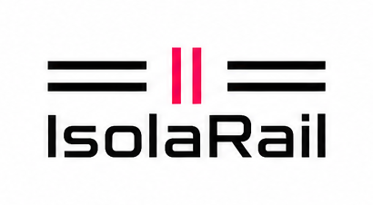

Logo 主锁定图 SVG：

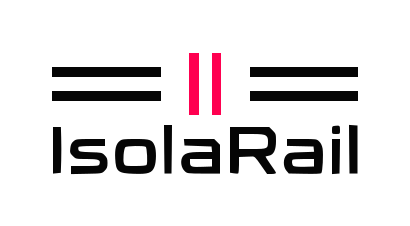

App Icon 设计源图（已批准）：

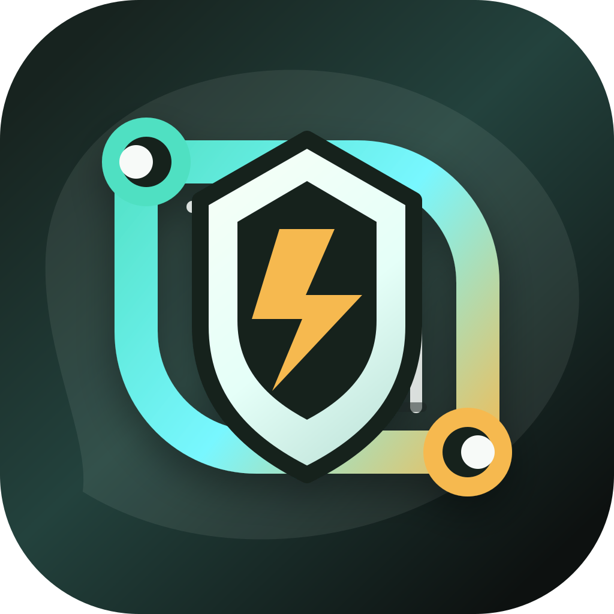

最终海报：

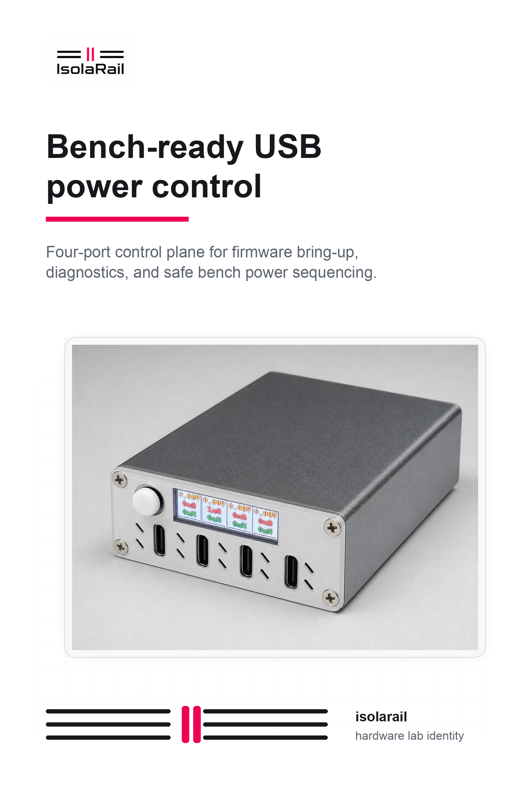

GitHub Social preview 主图：

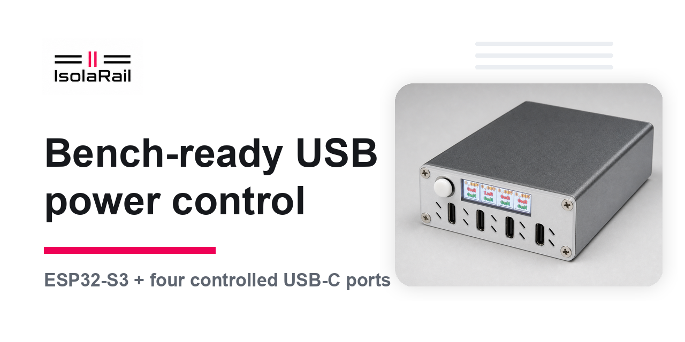

GitHub Social preview 变体：

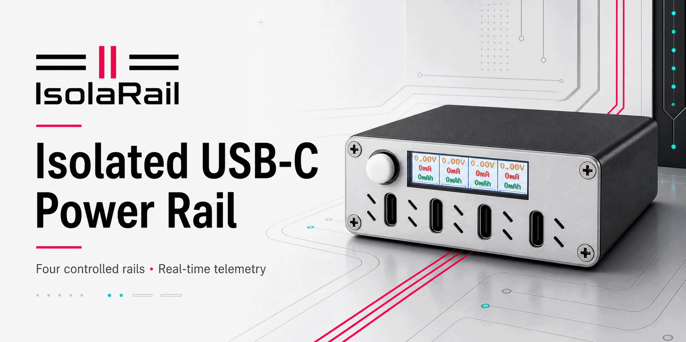

Runtime icon export:

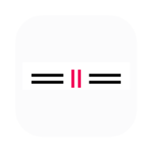

Runtime icon dark theme export:

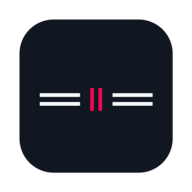

App Icon light SVG source:

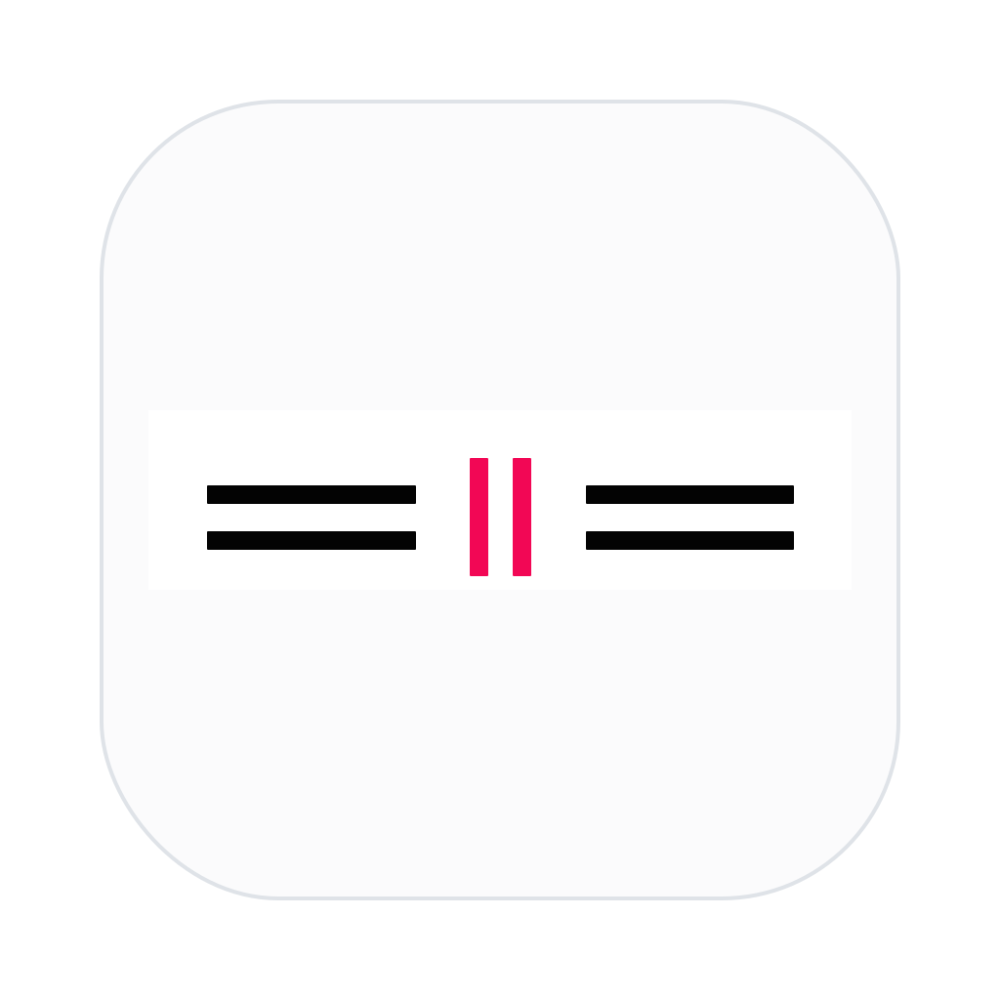

App Icon dark SVG source:

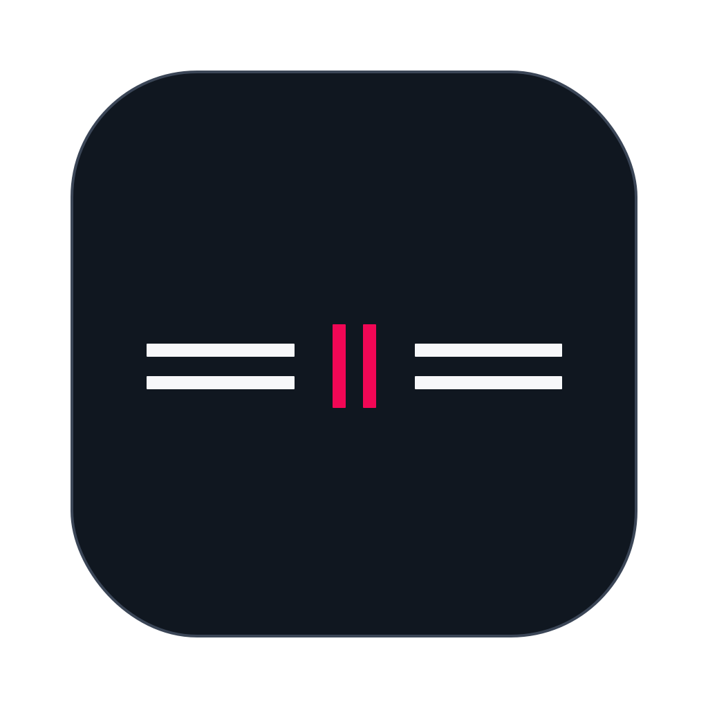

Logo light theme export:

Logo dark theme export:

  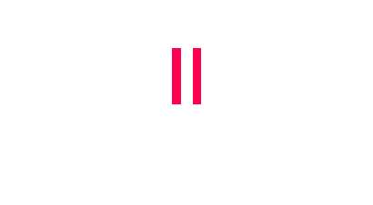

Logo light SVG source:

Logo dark SVG source:

  

HTML 海报产品场景素材：

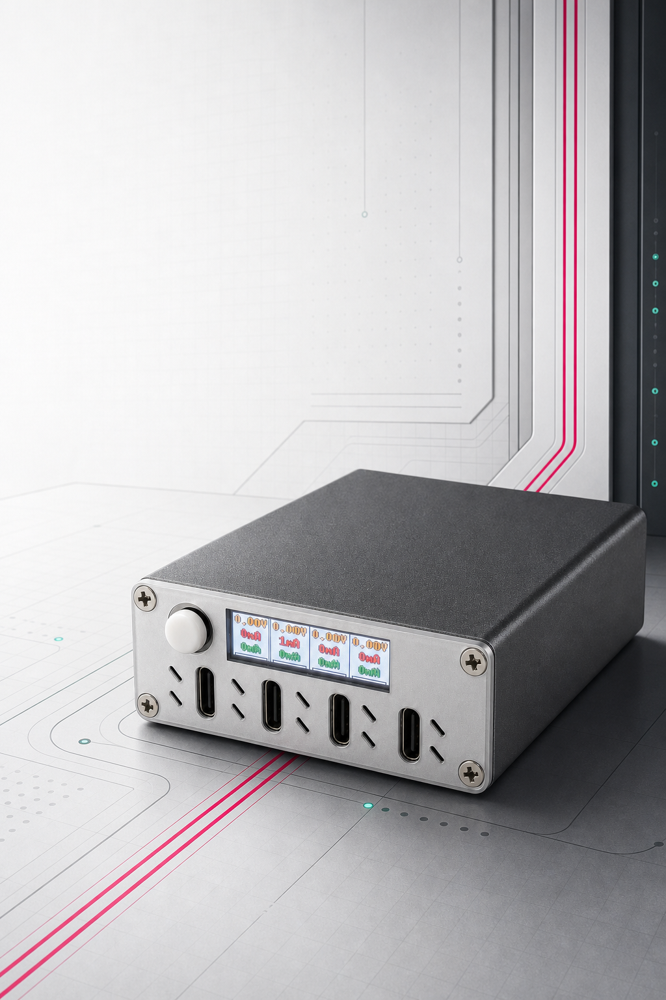

HTML social/hero 宽幅产品场景素材：

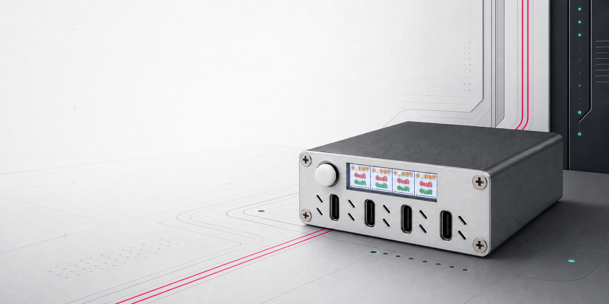

## 文档更新

- `README.md`
- `docs/assets/brand/README.md`
- `docs/specs/README.md`
- `docs/specs/b8r3n-brand-visual-assets/SPEC.md`

## 风险 / 开放问题 / 假设

- GitHub repository social preview 的实际上传需要 owner 在 GitHub repository settings 中执行。
- 后续 HTML 海报应复用产品场景素材，但应由 HTML/CSS 实现文字和布局，避免继续依赖不可编辑的 raster 海报文本。
