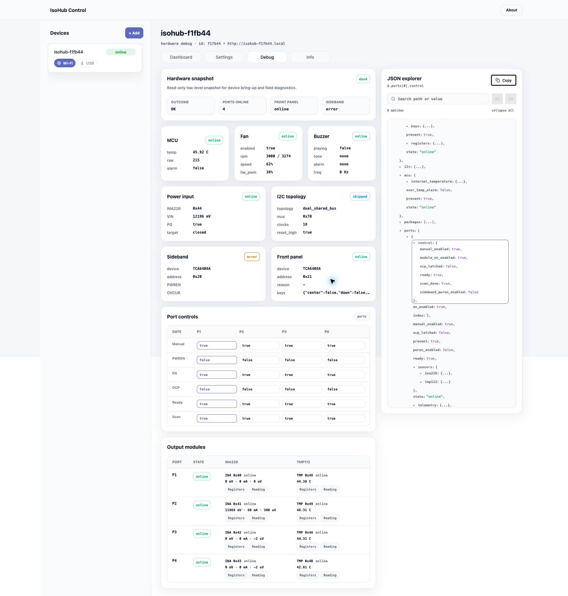
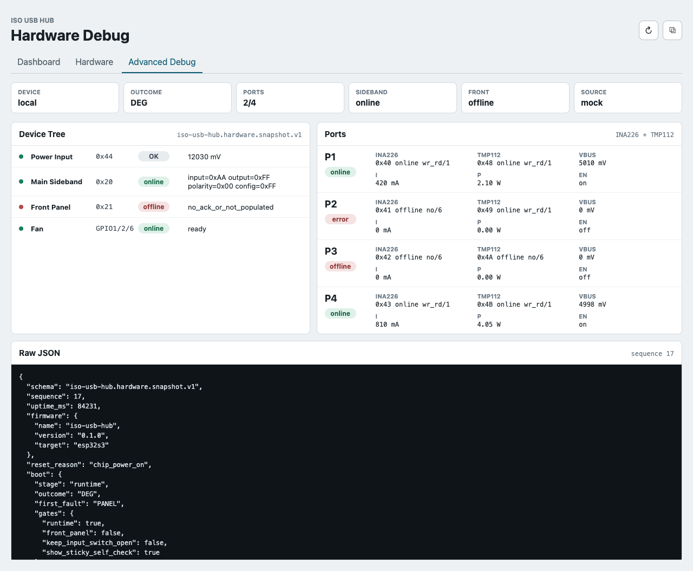
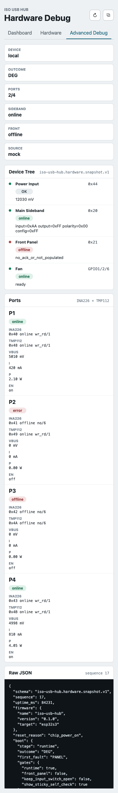

# IsolaRail 硬件底层详细信息快照接口

## 背景

调试 IsolaRail 时，需要一次性读取底层硬件状态，而不是从多条串口日志里人工拼接。当前固件已有 boot self-check、sideband、前面板、四路输出模块和风扇状态，但缺少统一 schema、host 读取链路和 Web 可视化入口。

## 目标

- 固件通过 Local USB JSONL `hardware.snapshot` 输出只读硬件快照 JSON，覆盖输入电源、I2C 拓扑、主板 sideband、前面板、MCU 内部状态、风扇、蜂鸣器、四路输出模块控制状态和 boot self-check。
- host-tools 使用本项目 source-built `isolarail` CLI 与 `isolarail-devd`。
- Web app 在 `/devices/:deviceId/debug/hardware` 展示高级硬件调试页。
- 四路输出模块和前面板可离线，离线只体现在对应节点，不导致整包失败。

## 非目标

- 不实现写寄存器、端口控制、强制复位、刷机或任何改变硬件状态的调试动作。
- 不修改 `vbus_ratio` 或 RATIO `0x08 bit0`。
- 不要求真机 HIL 作为本规格完成前置条件。

## Schema

固件 JSONL 方法 `hardware.snapshot` 返回：

```json
{"id":"...","ok":true,"result":{"schema":"isolarail.hardware.snapshot.v1"}}
```

顶层字段：

- `schema`: `isolarail.hardware.snapshot.v1`
- `sequence`, `uptime_ms`, `firmware`, `reset_reason`
- `boot`: self-check outcome、first fault、gate decision、sys checks
- `power_input`: `INA226@0x44`、VIN、PG、ready、目标电源状态
- `i2c`: `direct_shared_bus`、`PCA9545A@0x70` skipped、bus recovery 信息
- `sideband`: `TCA6408A@0x20`、寄存器、PWREN/OVCUR
- `front_panel`: `TCA6408A@0x21`、寄存器或离线原因
- `mcu`: ESP32-S3 运行期状态、内部温度原始值/毫摄氏值、过温告警
- `fan`: ready/state、使能状态、tach 是否可信、实测 RPM、目标 RPM、最大 RPM、控制速度百分比、目标速度百分比、反相后的硬件 PWM duty、风扇控制用内部温度和过温告警
- `buzzer`: LEDC driver ready、是否正在发声、当前 one-shot tone、当前循环 alarm、频率、duty
- `ports[]`: `INA226@0x40..0x43`、`TMP112@0x48..0x4B`、probe 方法、tries、telemetry、EN/PWREN/OCP
- `ports[].control`: 每路 `manual_enabled`、`sideband_pwren_enabled`、`module_en_enabled`、`ocp_latched`、`ready`、`scan_done`
- `ports[].sensors.ina226`: 每路输出模块 INA226 的 `present/state/method/tries/reason`；在线时必须包含 `reading.bus_voltage_mv`、`reading.shunt_voltage_uv`、`reading.current_ma`，以及 `config/shunt_voltage/bus_voltage/power/current/calibration/mask_enable/alert_limit/manufacturer_id/die_id` 寄存器值
- `ports[].sensors.tmp112`: 每路输出模块 TMP112 的 `present/state/method/tries/reason`；在线时必须包含 `reading.temperature_milli_c`，以及 `temperature/config/t_low/t_high` 寄存器值

节点状态统一为：

- `online`: 本次快照可读
- `offline`: 可选器件未 ACK 或未装配
- `skipped`: 前置条件不满足而未读
- `error`: 预期在线但运行期读取失败

## 行为规格

- 固件在 boot gate 完成后生成一次快照；若进入 fatal 自检页，也必须先生成失败快照。
- runtime 低频刷新快照缓存，默认约 10 秒一条。
- runtime 默认提供 full debug package；调用方请求硬件快照时，固件必须返回当前套餐集合内尽可能完整的数据，包括 MCU/fan/buzzer/端口控制状态。可选器件只要 boot probe 在线，就应尽量读取该器件读数和寄存器，即使所属端口未 ready。
- devd 通过 Local USB JSONL `hardware.snapshot` 读取最新缓存；可选模块离线不得导致方法失败。
- devd 默认 Unix socket IPC，HTTP bridge 只能显式启动。
- CLI 支持 `devices`、`status`、`diag-snapshot`、`diagnostics export`。
- Web 页面默认使用 mock data；带 `?devd=http://127.0.0.1:51210` 时通过 HTTP bridge 的 `/api/v1/devices/:id/diag-snapshot` 读取同一 schema。

## 验收标准

- 给定四路模块全在线，快照 `ports[].state` 均为 `online`。
- 给定输出模块 INA226/TMP112 在线，快照必须在对应 `ports[].sensors.*` 节点中返回本次读数和寄存器，而不能只返回 `present=true`。
- 给定单路 INA226 或 TMP112 离线，该路为 `error`，其它路保持自身状态。
- 给定四路全离线，整包仍返回 JSON，四路均为 `offline`。
- 给定前面板离线，`front_panel.state=offline`，整包仍返回 JSON。
- 给定 sideband 运行期读取失败，`sideband.state=error` 且输出保持关闭。
- 给定 runtime 已运行至少一个风扇控制周期，快照必须包含 MCU 内部温度、fan 实测 RPM/目标 RPM/控制百分比/硬件 PWM duty。
- 给定蜂鸣器 driver 初始化完成，快照必须包含 `buzzer.driver_ready=true`，并在 tone/alarm 播放期间反映 `playing/frequency_hz/duty_pct`。
- 给定四路输出进入 runtime，快照必须在 `ports[].control` 中返回手动门控、sideband PWREN、模块 EN、OCP latch、ready 与 scan 状态。
- CLI `isolarail --json diag-snapshot` 输出可被 Web 同一 schema 消费。

## 质量门槛

- `cargo +esp check`
- `cargo +esp build --release`
- `cargo test` in `tools/isolarail-companion`
- `bun install --frozen-lockfile && bun test && bun run build` in `web/`
- Web 改动需要可控视觉证据。

## Visual Evidence

Live devd hardware snapshot:



Desktop `ui_demo`:



Mobile `ui_demo`:



## 里程碑

- [x] 固件 schema 与 JSONL 输出
- [x] `isolarail`/`isolarail-devd` CLI/devd 与基础测试
- [x] Web 高级调试页与 mock schema
- [x] 项目文档同步
- [x] 真机串口端到端验证
