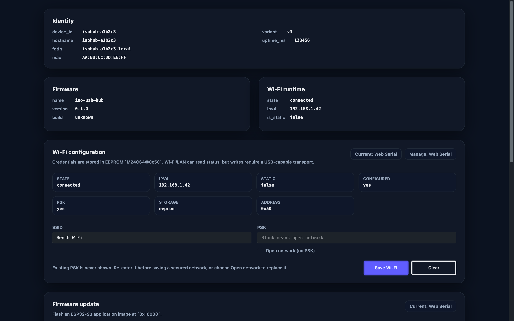
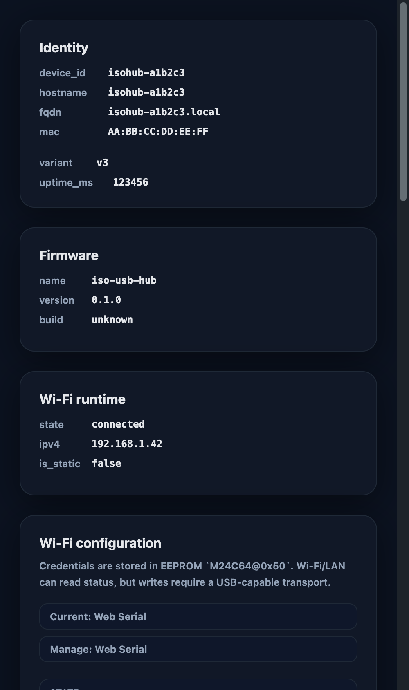

# 四路 USB Hub 控制面对齐（#pw97u）

## 状态

- Status: 部分完成（3/4）
- Created: 2026-06-09
- Last: 2026-06-13

## 背景 / 问题陈述

- 当前仓库是 `iso-usb-hub`，具备四路端口电源门控、CH335F sideband、前面板与 LCD dashboard，但缺少正式交付的 Wi-Fi/LAN、USB JSONL、本地 companion daemon、CLI 与 web app 控制面。
- 参考项目 `isolapurr` 已经验证了 `USB CDC JSONL + mDNS/HTTP + devd + CLI + Web` 的整套控制面模式，本项目需要复用这条架构路径，同时保持四路硬件语义与 V3 板约束。
- 如果继续停留在串口日志与临时脚本层，设备身份、配网、刷写、端口控制和诊断会长期分散在多个不稳定入口中。

## 目标 / 非目标

### Goals

- 设备端引入 `USB CDC JSONL + Wi-Fi/LAN HTTP + mDNS + EEPROM provisioning`。
- 交付 `isohub-devd` 与 `isohub`，统一 Local USB、LAN discovery、flash/reset/monitor、browser bridge 与 shared profile storage，并明确当前 `isohub` CLI 才是 owner-facing 门户；若未来引入 desktop 程序，也必须复用同一 daemon 语义。
- 交付 `web/` 三通道控制台，围绕四路 `port1..port4` 构建 Add device、Dashboard、Hardware、Info 工作流。
- 统一文档、构建、验证、视觉证据与 release 产物形状，收口到 `PR-ready`。

### Non-goals

- 不引入 Desktop/Tauri 客户端。
- 不复制参考项目的双口 USB-C route 或 power-config 编辑模型。
- 不把设备 HTTP v1 做成配对鉴权面。
- 不把当前任务升级为必须先完成下一版硬件 respin 的阻断项。

## 范围

### In scope

- 固件底座升级与模块重组。
- `M24C64@0x50` Wi-Fi 持久化。
- `isohub-devd` / `isohub` 本地 companion tools。
- `web/` 前端、Storybook、视觉证据。
- `README.md`、`docs/software_design.md`、`docs/hardware_connection_overview.md`、`docs/specs/README.md`。

### Out of scope

- Desktop/Tauri 壳层。
- 真 per-port data disconnect 硬件能力。
- 账号、云同步、远程 OTA、批量设备管理。

## 需求

### MUST

- 设备固件必须提供 `info|ports.get|port.power_set|port.replug|wifi.get|wifi.set|wifi.clear|reboot` 的 USB JSONL 接口。
- 设备固件必须提供 `/api/v1/health`、`/api/v1/info`、`/api/v1/ports`、`/api/v1/ports/{portId}`、`/api/v1/ports/{portId}/power`、`/api/v1/ports/{portId}/actions/replug`、`GET /api/v1/wifi`、`POST /api/v1/reboot` 的 HTTP 接口。
- 设备 profile 必须以 `port1..port4` 为唯一 owner-facing 端口模型。
- Wi-Fi 凭据和网络配置必须写入主板 `M24C64@0x50`，并带 magic/version 与完整性校验。
- `isohub-devd serve` 默认只开放本地 IPC；`isohub-devd bridge-http` 才允许 localhost bridge。
- 普通用户当前默认通过 `isohub` CLI 操作设备；若未来引入 desktop 程序，它也必须负责按需启动并复用全局单例 `isohub-devd`，而不是要求用户先手动启动 daemon。
- `isohub` 必须区分 `--hardware <saved-id>` 与 `--device <temporary-id>` 选择器语义。
- web runtime 必须统一仲裁 `Wi-Fi/LAN`、`Web Serial`、`Local USB bridge` 三个通道，避免重复设备。
- 当前 V3 板上的 `replug` 必须定义为“受控断电再上电”，而不是伪造真数据断连。

### SHOULD

- Web UI 应在 unsupported、busy、error、offline、USB-only 场景下给出明确状态与后续动作。
- companion tools 应提供固件身份校验、USB-only Wi-Fi 写操作门禁和日志/诊断导出。
- 文档应明确记录当前 V3 基线与后续硬件 ECO 边界。

## 功能与行为规格

### 命名真相源

- 本 spec 是当前仓库 owner-facing 与 repo-local 命名的真相源，覆盖固件 identity、CLI / daemon、web 文案、shared profile shape、HTTP / USB 契约、release 资产名与开发者入口文档。
- 电气/BOM/netlist 文档允许保留精确料号或历史资产名，但一旦进入 README、SPEC、IMPLEMENTATION、CLI、web、API 或 shared schema，就必须回落到本节定义的 canonical 名称。
- 本 spec 的软件包 inventory 覆盖当前仓内所有 manifest，并明确区分“本项目一方交付包”与“vendored/upstream example manifest”：root `Cargo.toml`、root `package.json`、`web/package.json`、`gc9d01/Cargo.toml`、`gc9d01/examples/**/Cargo.toml` 与 `tools/**/Cargo.toml`。凡属于这些 manifest 的 package / bin / workspace 目录，都必须在本节找到命名归属或排除规则。
- 当前仓内 `tools/firmware-catalog/` 仅包含 script 资产，不构成独立 package / binary；它可以作为 release 编排输入存在，但不得绕过本节单独发明 owner-facing 产品命名。
- 本 spec 的硬件命名 inventory 覆盖当前 README、hardware docs、software design 与 V3 引脚 spec 中被反复引用的主控、外围芯片、板级网络、维护动作与前面板/散热子系统；未收录的新硬件名称在进入 owner-facing 文档前，必须先补入本 spec。
- 低层 GPIO / pinmux / reset 拓扑 / display SPI 细节的完整事实源由 `docs/specs/j6nvw-hardware-v3-pin-assignment/SPEC.md` 持有；本 spec 只收录那些会进入 owner-facing 文档、shared schema、CLI/web 文案或跨文档反复出现的 V3 板级名称。

### Documentation Truth Boundary

| Document | Current authority | Notes |
| -------- | ----------------- | ----- |
| `docs/specs/pw97u-control-plane-alignment/SPEC.md` | owner-facing 软件包、二进制、port model、控制面子系统命名 | 当前任务的软件/硬件命名真相源 |
| `docs/specs/j6nvw-hardware-v3-pin-assignment/SPEC.md` | V3 GPIO、板级网络、显示链路、scoped reset 事实 | pin-level truth 在这里冻结；不得再回退到 `docs/plan/**` |
| `docs/software_design.md` | 当前固件运行时行为、boot self-check、runtime 门控语义 | 使用的术语必须服从本 spec 与 `j6nvw` pin spec |
| `README.md` | 当前项目入口说明 | 汇总性文档，不单独发明新命名 |
| `docs/hardware_connection_overview.md` | 当前 V3 硬件总览 | 负责跨文档共享的 V3 板级总览、四路设备模型与关键子系统拓扑；术语必须服从本 spec 与 `j6nvw` spec |
| `docs/esp32-s3fh4r2_gpio_assignment_guide.md` | 历史 GPIO 参考 | 仅用于保留早期 FH4R2 / V2 讨论背景；不得覆盖当前 V3 pin-level 口径 |
| `docs/ch335f_tca6408a_appnote.md` | CH335F sideband 电气参考 | 元器件级 bring-up / 侧带接法参考；可保留供应商器件名与引脚级术语，但不得定义 owner-facing 命名 |
| `docs/i2c_gpio_expanders_comparison.md` | I²C expander 选型参考 | 历史选型与备选料号比较；可保留候选器件名，但不得覆盖当前 V3 canonical 命名 |
| `docs/power_management_and_startup_control.md` | 历史电源管理方案参考 | 早期 PG/上电时序研究；允许出现 `TPS82130SILR` 等旧方案器件名，但不代表当前 V3 `TPS2490` 路径 |
| `docs/pwm_fan_control_circuit_design.md` | 风扇电路参考 | 局部电路设计说明；可保留 `RT9043GB` 等局部器件名，但 owner-facing 子系统名仍为 `fan` |
| `docs/development_notes.md` | 临时开发记录 | 观测笔记 / working notes；不能作为命名、接口或硬件边界真相源 |
| `docs/hardware/**/*.enet.enet` | 网表 / CAD 导出资产 | BOM、网络名、器件料号与历史资产名参考；允许保留精确料号、网表网络名与 CAD 资产标题，但不得单独定义 owner-facing 命名 |
| `docs/plan/j6nvw-hw-v3-pin-assignment/**` | 历史计划输入 | 一旦与 `docs/specs/j6nvw-hardware-v3-pin-assignment/SPEC.md` 冲突，以后者为准 |

- 除上表列为 `Current authority` 的文档外，其余硬件资料默认都是参考或历史输入；它们可以保留原始料号、候选器件与早期术语，但不得单独改写当前 V3 控制面的 owner-facing 命名。

### Canonical Naming Matrix

| Scope | Canonical name | Applies to | Notes |
| ----- | -------------- | ---------- | ----- |
| GitHub repo / firmware package | `iso-usb-hub` | repo root, root `Cargo.toml`, release artifact identity | 仓库名与固件 package/name 保持一致 |
| USB JSONL / HTTP identity | `firmware.name="iso-usb-hub"` | device `info`, companion identity verification, web runtime | companion/web 以此做设备身份校验 |
| mDNS hostname | `isohub-<shortid>` | mDNS, LAN discovery, saved hardware profile | 不使用 `iso-usb-hub-<shortid>` |
| Local daemon binary | `isohub-devd` | release binaries, CLI auto-spawn target, docs | 默认只跑原生 IPC |
| CLI portal binary | `isohub` | owner-facing terminal entrypoint | 普通用户默认入口 |
| Companion workspace | `tools/isohub-companion/` | repo-local source tree | 仅表示本机配套工具集合 |
| Companion Cargo package | `isohub-companion` | `tools/isohub-companion/Cargo.toml` | 不对外暴露为产品名 |
| Frontend package | `web` | repo-local frontend package | owner-facing 产品名不是 `web` |
| Root JS tooling manifest | `isohub-dev-tools` | repo root `package.json` | repo tooling 元数据，不是产品名 |
| Developer entrypoint | `just` | README, INSTALL, contributor docs, local development commands | 不把 `bun` 作为默认开发入口 |
| Daemon IPC mode | `isohub-devd serve` | local daemon default mode | 只开放原生系统 IPC |
| Explicit browser bridge mode | `isohub-devd bridge-http` | localhost HTTP bridge | 仅开发/浏览器路径显式启用 |
| Owner-facing port ids | `port1` `port2` `port3` `port4` | HTTP / USB / CLI / web / shared schema | 全部一致 |
| Port labels | `Port 1` `Port 2` `Port 3` `Port 4` | UI copy, logs, diagnostics export | 不再用 `USB-A` / `USB-C` |
| Board baseline | `V3` | current deliverable hardware baseline | 指当前软件落地基线板 |

### Software Package Matrix

| Package / target | Canonical name | Scope | Owner-facing | Notes |
| ---------------- | -------------- | ----- | ------------ | ----- |
| Root firmware Cargo package | `iso-usb-hub` | root `Cargo.toml` `[package].name` | yes | 也是设备 `firmware.name` 的真相源 |
| Companion workspace directory | `tools/isohub-companion/` | repo-local source tree | no | 表示本仓配套工具工作区 |
| Companion Cargo package | `isohub-companion` | `tools/isohub-companion/Cargo.toml` `[package].name` | no | 仅用于构建/发布编排，不作为产品入口名 |
| Companion daemon binary | `isohub-devd` | `tools/isohub-companion` `[[bin]]` | yes | CLI/未来 desktop 复用的后台单例 |
| Companion CLI binary | `isohub` | `tools/isohub-companion` `[[bin]]` | yes | 普通用户默认入口 |
| Frontend package | `web` | `web/package.json` `name` | no | repo-local 包名；owner-facing 产品名仍是 `isohub` 控制台 |
| Root JS tooling package | `isohub-dev-tools` | repo root `package.json` `name` | no | 仅承载 commitlint 与 repo-level JS tooling 元数据 |
| Display driver crate | `gc9d01` | vendored submodule / firmware dependency | no | 内部驱动依赖，不提升为产品命名 |
| Vendored display example packages | `esp32s3-160-50-direct-spi`、`esp32s3-160-50-embedded-graphics`、`stm32g4-160-40`、`stm32g4-160-40-embedded-graphics`、`stm32g4-160-40-direct-spi`、`stm32g4-160-40-90-complex-patterns`、`stm32g4-160-40-direct-spi-90-complex-patterns` | `gc9d01/examples/**/Cargo.toml` | no | 上游驱动示例包；允许保留示例名，但不得影响 `isohub` 产品命名或 release 资产 |
| Dashboard preview crate | `dashboard_preview` | `tools/dashboard_preview/Cargo.toml` `[package].name` | no | 本地 LCD/布局预览工具，不作为交付产品名 |
| Icon conversion crate | `icon2raw` | `tools/icon2raw/Cargo.toml` `[package].name` | no | 开发期资源转换工具 |
| PNG conversion crate | `png2raw` | `tools/png2raw/Cargo.toml` `[package].name` | no | 开发期资源转换工具 |

### Manifest Coverage Audit

- 已纳入命名矩阵的 manifest：
  - root `Cargo.toml`
  - root `package.json`
  - `tools/isohub-companion/Cargo.toml`
  - `web/package.json`
  - `gc9d01/Cargo.toml`
  - `tools/dashboard_preview/Cargo.toml`
  - `tools/icon2raw/Cargo.toml`
  - `tools/png2raw/Cargo.toml`
  - `gc9d01/examples/**/Cargo.toml`
- 当前审计结果下，仓内不存在未被命名矩阵覆盖的额外 `Cargo.toml` 或 `package.json`。
- `tools/firmware-catalog/` 当前是 script-only 目录，不属于 package inventory；若后续新增 manifest，必须先更新本节再进入交付面。

### Hardware Naming Coverage Boundary

- `Hardware Naming Matrix` 覆盖的是当前 V3 控制面会进入 README、SPEC、CLI、web、shared schema、USB/HTTP contract 与 diagnostics export 的 canonical 名称。
- 历史/参考硬件文档允许保留精确料号、备选器件与局部电路器件名；当前仓内已知的 reference-only 例子包括 `TPS82130SILR`、`RT9043GB`、`TCA6408APWR`、`TCA6408ARSVR`、`TCA9535RTWR`。
- `docs/hardware/**/*.enet.enet` 里的 `DeviceName`、`Manufacturer Part`、`LCSC Part Name`、`3D Model Title` 与原始 `net` 字段同样属于 reference-only 证据；它们可以解释 BOM、网表和 CAD 历史，但不能越级成为 README、CLI、web、API 或 shared schema 的命名来源。
- 这些 reference-only 名称只能停留在选型比较、局部电路说明、早期方案研究或 BOM/netlist 语境中，不得直接提升为当前 V3 控制面的产品术语、UI 文案、CLI 命令、API 字段或 shared schema。
- 若后续有新的器件家族名或板级网络名需要进入 owner-facing 交付面，必须先补入本 spec，再修改实现或对外文档。

### Hardware Naming Matrix

| Scope | Canonical name | Applies to | Notes |
| ----- | -------------- | ---------- | ----- |
| Main controller family | `ESP32-S3` | README, control-plane spec, product docs, firmware overview | 控制面规格使用器件家族名，不把 BOM 变体写成产品名 |
| USB hub controller | `CH335F` | hardware/docs, firmware sideband, diagnostics | 当前四路 Hub 数据与上游语义的核心控制器 |
| Wi-Fi/profile EEPROM | `M24C64@0x50` | provisioning, hardware docs, firmware docs | BOM 精确料号可出现在电气资料中 |
| Input power hot-swap controller | `TPS2490` | power-in docs, boot self-check, runtime power diagnostics | 控制 `IN_EN` / `IN_PG` 语义 |
| Input power nets | `VIN_UNSAFE` / `VIN` | hardware docs, boot diagnostics, power-path discussions | 不用模糊的 `input rail` 替代 |
| Input power control nets | `IN_EN` / `IN_PG` | firmware power gating, boot logs, hardware docs | `IN_EN` 高有效，`IN_PG` 高表示 good |
| Input voltage ADC sense net | `VIN_ADC` | power-in diagnostics, firmware docs, hardware docs | 只表示 MCU 分压采样点，不替代 `VIN` 母线命名 |
| Upstream isolation status | `ISOUSB211 V1OK` | sideband mode selection, hardware docs, diagnostics | 运行期可简称 `V1OK`，但文档首次出现应带 `ISOUSB211` |
| Upstream isolation GPIO net | `ISO_OK` | pinout docs, board netlists, GPIO mapping notes | 仅作为板级网络名；owner-facing 运行时状态仍归一为 `ISOUSB211 V1OK` |
| Legacy USB power-module pair | `SC8815 + SW2303` | legacy V2 hardware docs, migration notes | 仅用于描述旧电源子板，不提升为当前 V3 控制面产品语义 |
| Native USB PHY pair | `USB D+` / `USB D-` | bring-up docs, provisioning path, board connectivity docs | 仅表示 ESP32-S3 原生 USB 差分对，不引申成 owner-facing 端口名 |
| Mainboard sideband expander | `Mainboard TCA6408A@0x20` | sideband spec, runtime diagnostics, hardware docs | 负责 `PWREN#` 读取与 `OVCUR#` 注入 |
| Front-panel expander | `Front-panel TCA6408A@0x21` | display/front-panel spec, boot self-check, hardware docs | 负责前面板输入与 LCD `CS/RES` 控制 |
| I²C mux slot | `PCA9545A@0x70` | legacy hardware docs, future mux discussions, boot topology slot | 当前 V3 运行期可为 skipped，但命名保持固定 |
| PCA9545A interrupt summary | `PCA9545A INT/INTx` | legacy hardware docs, mux topology notes | 仅用于硬件拓扑说明，不映射成控制面动作 |
| Shared I²C interrupt net | `I2C_INT` | pinout docs, board netlists, bring-up notes | 表示 MCU 侧 I²C 外设汇总中断输入，不替代具体器件命名 |
| Shared I²C bus pair | `I2C_SDA` / `I2C_SCL` | pinout docs, board netlists, bring-up notes | MCU 主 I²C 总线网络名；owner-facing 行为仍按器件/总线语义描述 |
| Shared I²C reset net | `I2C_RESET` | pinout docs, board netlists, bring-up notes | 仅表示板级复位网络别名；owner-facing 文档仍优先用 scoped reset 名 |
| Hub sideband nets | `PWREN1#..4#` / `OVCUR1#..4#` | board docs, firmware diagnostics, hardware spec | 保留板级网络命名，不映射成双口语义 |
| Port gate nets | `EN1..EN4` | board docs, firmware control path | 对应 `port1..port4` 的受控供电门控 |
| Legacy power-module stop nets | `PSTOP_CTL1..4` / `PSTOP1..4` | legacy V2 hardware docs, migration notes | 仅用于 V2 板级语义；当前 V3 owner-facing 控制面不再以此建模端口动作 |
| Hub reset net | `HUB_RESET#` | firmware init, hardware docs, diagnostics | CH335F 复位控制，不映射成端口动作 |
| Hub sideband control pair | `HUB_SDA` / `HUB_SCL` | pinout docs, board netlists, sideband bring-up notes | 仅表示 CH335F 复用 sideband 控制线，不替代 I²C 主总线命名 |
| Mainboard reset net | `Mainboard RESET#` | boot-init docs, hardware docs | 指 MCU 控制的主板复位网络；避免与前面板器件 reset 混淆 |
| Front-panel expander reset pin | `Front-panel TCA6408A RESET#` | hardware docs, boot-init docs | 只用于说明前面板 expander 的局部 reset 拓扑 |
| Telemetry current monitor family | `INA226` | software design, hardware docs, telemetry discussions | 作为输入与端口电流/电压检测器件家族名使用；具体地址仍按输入或各端口块限定 |
| Telemetry temperature sensor family | `TMP112` | software design, hardware docs, telemetry discussions | 作为四路输出温度传感器家族名使用；不单独代替端口编号 |
| Input power monitor | `Input INA226@0x44` | power-in diagnostics, boot self-check, hardware docs | 不与端口遥测地址混用 |
| Per-port telemetry blocks | `Port 1 INA226@0x40 + TMP112@0x48` ... `Port 4 INA226@0x43 + TMP112@0x4B` | hardware docs, diagnostics export, firmware telemetry | 端口编号必须与 `port1..port4` 一致 |
| Display module | `160x50 LCD` | product/docs/UI references | 需要驱动语境时再补 `GC9D01` |
| Display driver IC | `GC9D01` | firmware/display docs | 不是 owner-facing 产品名 |
| Display SPI nets | `LCD_DC` / `LCD_MOSI` / `LCD_SCLK` | pinout docs, board netlists, display bring-up docs | 板级显示 SPI 网络名，不直接作为用户可操作对象 |
| LCD control nets | `LCD_CS` / `LCD_RST` / `LCD_RES` / `LCD_BLK` | pinout docs, board netlists, display bring-up docs | `LCD_RST` 与 `LCD_RES` 视为同一 reset 网络的双写法；owner-facing 页面统一称 display reset / backlight |
| Front panel assembly | `front panel` | product/docs/UI references | 不把 CAD 历史资产名当成产品命名 |
| Front-panel input cluster | `front-panel 5-way switch` | UI docs, front-panel task, hardware docs | 不再写成模糊的 `buttons` |
| Acoustic indicator | `buzzer` | UI docs, pinout docs, diagnostics copy | 文档内统一使用 `buzzer`，板级网络别名为 `BUZZER` |
| Cooling subsystem | `fan` | thermal docs, runtime telemetry, boot self-check | 文档内统一使用 `fan`，板级控制/反馈网络别名为 `FAN_PWM` / `FAN_EN` / `FAN_TACH` |
| Hub-wide maintenance action | `hub.reset` | USB JSONL, CLI, web maintenance copy | 与 `port.replug` 明确区分 |

### BOM / Netlist Alias Policy

- `ESP32-S3R2`、`ESP32-S3FH4R2`、`M24C64-FMC6TG`、`TCA6408ARGTR`、`TCA6408APWR`、`TCA6408ARSVR`、`USB-C HUB 前面板PCB` 这类名称只允许作为 BOM、网表、料号、原理图或历史资产别名出现。
- `TPS2490DGSR`、`ISOUSB211DPR`、`TMP112AIDRLR`、`PCA9545APW`、`TPS82130SILR`、`RT9043GB`、`TCA9535RTWR` 这类精确料号同样只允许保留在 BOM、网表、原理图、选型比较或历史方案上下文中。
- `BUZZER`、`FAN_PWM`、`FAN_EN`、`FAN_TACH`、`HUB_SDA`、`HUB_SCL`、`I2C_INT`、`I2C_RESET`、`ISO_OK`、`LCD_CS`、`LCD_RST`、`LCD_RES`、`LCD_BLK`、`USB D+`、`USB D-` 这类板级网络名允许保留在 pinout、网表、bring-up 文档与硬件拓扑说明中，但进入 owner-facing 交付面时必须回落到对应的 canonical 子系统名或行为语义。
- `I2C_SDA`、`I2C_SCL`、`LCD_DC`、`LCD_MOSI`、`LCD_SCLK` 这类 pin-level 网络名同样只允许停留在 V3 pin spec、pinout、网表、bring-up 与显示链路说明中，不得直接变成 owner-facing 功能名或 UI 文案。
- `esp32s3-160-50-direct-spi`、`stm32g4-160-40-direct-spi` 这类 `gc9d01/examples/**` 的示例包名只允许停留在 vendored 示例目录与驱动示例说明中，不得上升为本项目 release 资产、CLI、daemon、web、spec 或 README 的产品命名。
- owner-facing 文案、topic spec、shared schema、CLI help、web 页面、HTTP / USB API、release 资产与 README 不得用这些别名替代本 spec 的 canonical 名称。
- 当确实需要同时表达家族名和精确料号时，写法应为“canonical 名称 + 补充括号说明”，例如 `ESP32-S3 (BOM variant in board docs)`，而不是直接把精确料号提升为产品命名。

### Forbidden Naming

- 本项目 owner-facing 软件包、命令、页面、文案中禁止使用 `isolapurr`、`isolapurr-devd`、`host-devd`、`host tools` 作为本项目名称。
- 本项目 owner-facing 端口、API 字段、UI 文案中禁止继续使用 `port_a`、`port_c`、`USB-A`、`USB-C`、`route/power-config`、`hub.route_set` 作为当前产品语义。
- `host` 一词若出现，只允许作为网络协议字段中的通用英语语义，不得用于本项目软件包、命令、产品模块命名。
- 本项目 owner-facing 文档、CLI、web、shared schema 中禁止把 `ESP32-S3R2`、`ESP32-S3FH4R2`、`M24C64-FMC6TG`、`TCA6408ARGTR`、`TCA6408APWR`、`TCA6408ARSVR`、`TPS2490DGSR`、`ISOUSB211DPR`、`TMP112AIDRLR`、`PCA9545APW`、`TPS82130SILR`、`RT9043GB`、`TCA9535RTWR`、`USB-C HUB 前面板PCB` 直接当作控制面产品命名使用。
- 本项目 owner-facing 文档与 release 资产中禁止把 `gc9d01/examples/**` 的示例包名、`SC8815+SW2303`、`PSTOP_CTL`、`PSTOP`、未限定作用域的 `RESET#` 直接当作当前 V3 控制面的产品术语。
- 本项目 owner-facing 文档、CLI、web、shared schema 中禁止把 `BUZZER`、`FAN_PWM`、`FAN_EN`、`FAN_TACH`、`HUB_SDA`、`HUB_SCL`、`I2C_INT`、`I2C_RESET`、`ISO_OK`、`LCD_CS`、`LCD_RST`、`LCD_RES`、`LCD_BLK`、`USB D+`、`USB D-` 直接当作产品功能名或用户可操作对象。
- 本项目 owner-facing 文档、CLI、web、shared schema 中禁止把 `I2C_SDA`、`I2C_SCL`、`LCD_DC`、`LCD_MOSI`、`LCD_SCLK`、`GPIO13`、`GPIO14`、`GPIO0`、`CHIP_PU` 这类 pin-level 名称直接当作产品模块、设备能力或用户操作对象。
- repo-local package 命名也不得再新增 `isolapurr-*`、`host-*`、`desktop-agent*` 这类会把参考项目或运行时实现细节误当成产品边界的包名；如确需内部适配层，命名也必须落回 `isohub-*` 或功能性中性名。

- 设备身份：`firmware.name="iso-usb-hub"`，hostname 为 `isohub-<shortid>`，HTTP `info`、USB `info`、devd、CLI 与 web domain 共享同一 identity shape。
- 端口模型：`port1..port4` 每路包含 power/data/ocp/pwren/en/telemetry/runtime channel state；断路、初始化、过流、手动关闭必须区分显示。
- companion 进程拓扑：`isohub-devd` 作为本机全局单例后台进程存在；当前 `isohub` CLI 是默认 owner-facing 门户，负责发现已运行实例、按需自启 `serve` 模式 daemon，并通过本地 IPC 复用同一实例；未来若引入 desktop 程序，也必须复用这套单例语义；`bridge-http` 仅在 Web 路径显式需要时开启。
- 原生 IPC 机制：`isohub-devd serve` 在 Unix 平台必须使用 Unix domain socket，在 Windows 必须使用 named pipe；`bridge-http` 只是显式附加的 localhost browser bridge，不能替代默认 IPC。
- 通道仲裁：当多个通道同时可用时，采用“最后成功通道优先”；当前通道失效时自动提升另一条可用通道，不新建重复设备。
- Wi-Fi 写策略：LAN HTTP 路径只读；`wifi.set` / `wifi.clear` 必须要求 `Web Serial` 或 `Local USB bridge` 当前可用。
- `port.replug`：关闭对应 `ENx`，等待受控恢复窗口后重新打开；成功证据为设备侧动作完成与 companion/runtime 观察到的状态更新。
- `hub.reset`：作为整机级维护动作单独暴露，不替代 `port.replug` 的 owner-facing 语义。

## 验收标准

- Given 当前 V3 板启动成功，When 用户通过 USB JSONL 或 LAN HTTP 请求 `info`，Then 返回一致的 firmware identity、hostname、MAC 与 Wi-Fi 状态。
- Given 四路输出存在运行期遥测，When 请求 `ports.get` 或 `GET /api/v1/ports`，Then `port1..port4` 返回与 CH335F sideband/OCP/手动门控一致的状态。
- Given Wi-Fi 凭据通过 USB-capable 通道写入，When 设备重启或重新连网，Then 固件从 `M24C64@0x50` 恢复配置并更新 HTTP `info` / USB `wifi.get`。
- Given `isohub-devd serve` 正在运行，When 未显式启动 bridge，Then localhost 不应暴露 HTTP API。
- Given `isohub-devd serve` 在 Unix 平台启动，When companion/CLI 连接 daemon，Then 连接路径必须走 Unix domain socket 而不是 localhost HTTP。
- Given `isohub-devd serve` 在 Windows 平台启动，When companion/CLI 连接 daemon，Then 连接路径必须走 named pipe 而不是 localhost HTTP。
- Given 普通用户从 `isohub` CLI 发起本地操作，When 本机尚无可用 daemon，Then `isohub` 应自动启动或连接全局单例 `isohub-devd serve`，而不是要求用户先手动执行 `devd-serve`。
- Given web app 已绑定同一设备的多条通道，When 当前主通道失效，Then 运行时切换到其他可用通道而不创建重复条目。

## 实现前置条件

- 当前 V3 板的 `M24C64`、USB D+/D-、CH335F、四路 `EN` 与 sideband 拓扑事实已冻结。
- owner-facing 命名空间 `isohub` / `isohub-devd` 与 `port1..port4` 已冻结。
- `replug=power-cycle` 与 `hub.reset` 语义已冻结。

## 非功能性验收 / 质量门槛

### Testing

- `cargo +esp check`
- `cargo +esp build --release`
- companion tools `cargo test`
- web `just web-test-unit` / `just web-build`
- Storybook / Playwright 关键状态验证

### Naming Conformance

- `docs/specs/pw97u-control-plane-alignment/SPEC.md` 必须继续作为软件包名、二进制名、硬件基线名与板级子系统 canonical naming 的单一真相源。
- `docs/specs/j6nvw-hardware-v3-pin-assignment/SPEC.md` 必须继续作为 V3 GPIO、pin-level 网络名、显示链路与 scoped reset 真相源；`docs/plan/**` 与历史 GPIO 参考文档不得覆盖它。
- root `Cargo.toml`、`tools/isohub-companion/Cargo.toml`、`web/package.json`、README、web owner-facing copy、CLI help、HTTP/USB identity 与 shared schema 不得偏离本 spec 的 `Canonical Naming Matrix`、`Software Package Matrix` 与 `Hardware Naming Matrix`。
- `gc9d01/examples/**` 的 vendored 示例包、legacy `SC8815/SW2303/PSTOP*` 板级术语与 scoped reset/INT 命名，必须按本 spec 的排除/限定规则出现；它们可以保留在示例或硬件拓扑文档中，但不得漂移进 owner-facing 控制面边界。
- 除“参考项目说明”“历史兼容说明”“BOM/netlist 别名说明”三类受控语境外，项目文档与 owner-facing 文案中不得重新引入 `isolapurr`、`host-devd`、`port_a`、`USB-C route` 等禁用命名。
- `docs/hardware_connection_overview.md` 必须保持当前 V3 四路设备模型、`EN1..EN4`、`PWREN#` / `OVCUR#`、输入电源路径与前面板/显示链路的 current truth；历史 GPIO 与 V2 讨论若仍需保留，应停留在明确的 legacy 文档中。

### UI / Visual Evidence

- `Add device`、`Device Dashboard`、`Device Hardware`、`Device Info` 至少提供一组桌面与窄屏视觉证据。
- 最终效果图写入本 spec 的 `## Visual Evidence`。

## 文档更新

- `README.md`
- `docs/software_design.md`
- `docs/hardware_connection_overview.md`
- `docs/specs/README.md`

## 实现里程碑

- [x] M1: PRODUCT/DESIGN、spec、命名空间与 shared type 约束落地
- [x] M2: 固件引入 USB JSONL、Wi-Fi provisioning、mDNS/HTTP 与四路 API 状态模型
- [x] M3: companion tools 与 web app 端到端打通三通道控制面
- [ ] M4: 文档、验证、视觉证据与 review-proof 收口到 `PR-ready`

## 风险 / 开放问题 / 假设

- 风险：当前仓与参考仓的 `esp-hal/embassy/esp-radio` 版本差异可能导致固件底座整合成本高于预期。
- 风险：V3 板的 `PWREN1#/2#` 连接缺陷会影响部分 upstream-managed 路径的真实行为验证。
- 假设：当前控制面对齐优先覆盖四路端口状态与维护工作流，不追逐参考项目中与当前硬件无关的 USB-C 电源配置能力。

## Visual Evidence

- source_type: `storybook_canvas`
  story_id_or_title: `Panels/DeviceInfoPanel/WebSerialActivity`
  scenario: `desktop monitor timeline`
  evidence_note: 验证 `Device Info` 在桌面视口下同时展示 JSON response、raw CDC line 与 defmt/raw binary frame 三类单口混流活动。
  

- source_type: `storybook_canvas`
  story_id_or_title: `Panels/DeviceInfoPanel/NarrowWebSerial`
  scenario: `narrow monitor timeline`
  evidence_note: 验证窄屏下同一 `Device Info` monitor 面板仍保留可读的 serial activity 表格与 Wi-Fi / firmware 控制布局。
  
